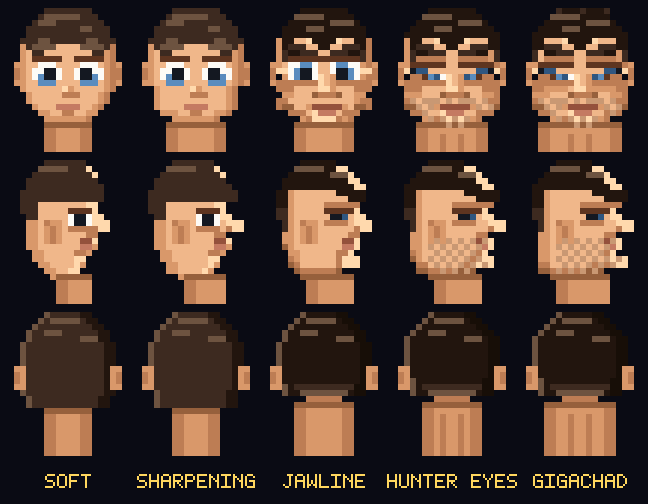

# BP MAN — MOG CITY

A high-resolution pixel-art maze chase in the Pac-Man tradition, except you are
walking a neon city at night, the pellets are black pills, the power-ups are
hammers, and the point is to **get handsome**.

Every hater you mog sharpens your face. You start soft and round with wide doe
eyes; twenty-four mogs later you have a mandible, hollow cheeks, stubble and
hooded, tilted hunter eyes.


## Play it

Open `index.html` in a browser. No build step, no dependencies, no server.

There is also a single-file build at `dist/bpman.html` if you want one file you
can email to someone.

## Controls

| Input | Action |
| --- | --- |
| Arrow keys / WASD | Walk |
| Space | **Aura burst** (when the meter is full) |
| P | Pause |
| M | Mute |
| Enter | Start / restart |
| Swipe, tap | Touch controls (tap = aura burst) |

## How it plays

- **Black pills** are the pellets. Each one is 10 points and a sliver of AURA.
- **Hammers** are the power-ups. Grab one and the haters turn *cooked* — pale,
  sweating and fleeing. Smash them for 200, 400, 800, 1600 in a chain.
- **AURA** fills as you eat. At 100% press Space for an **aura burst**: a
  shockwave that mogs every hater it touches, wherever they are on the block.
  It costs the whole meter, so time it.
- **Bonus pickups** appear mid-level — gym weights, mogger shades, a chin
  chisel, a golden hammer (which also triggers hammer time), a crown.
- **Every mog is a looksmax point.** Cross a threshold and the game stops for an
  ascension cutscene showing your old face beside the new one, front and profile.


## The looksmax ladder

| Mogs | Tier | What changes |
| --- | --- | --- |
| 0 | SOFT | Round skull, doe eyes, soft mop |
| 3 | SHARPENING | Taper begins, brows drop |
| 8 | JAWLINE | Mandible flares, cheeks hollow, chin lights up |
| 15 | HUNTER EYES | Hooded slits with positive canthal tilt, stubble |
| 24 | GIGACHAD | Everything, plus the chain and the glow |



Reach GIGACHAD *and* clear the city you are on to win. After that the city
keeps going, faster, forever.

## The haters

| | Name | Behaviour |
| --- | --- | --- |
| red | ENVY | Locks on and comes straight at you |
| pink | SMIRK | Aims four tiles ahead of where you are going |
| cyan | SHADE | Flanks, using ENVY's position to pincer you |
| orange | LURK | Charges from range, backs off along your trail up close |

They alternate between scattering to their corners and hunting you, and they
reverse direction on every phase change — same rhythm as the arcade original.

## How it's built

Vanilla JS and a single 2D canvas. Everything is drawn at 1 art-pixel to 1
canvas-pixel into an offscreen 448×598 buffer, then blitted to the visible
canvas at an integer scale with smoothing off, so it stays genuinely crisp
instead of being a blurry upscale.

| File | What's in it |
| --- | --- |
| `js/font.js` | 5×7 bitmap arcade font |
| `js/maze.js` | The 28×31 city grid and spawn points |
| `js/face.js` | The parametric face — skull half-widths, eyes, brows, hair, stubble, all keyed off tier |
| `js/sprites.js` | Walk cycles, haters, hammers, pills, bonus items |
| `js/city.js` | Bakes the maze into buildings, neon trim, wet asphalt, lamp pools |
| `js/audio.js` | WebAudio synthesis — no sound files |
| `js/game.js` | State machine, hater AI, aura mechanics, HUD, screens |

The face is the interesting part. Rather than five hand-drawn portraits, there
is one renderer that interpolates a table of skull half-widths from SOFT to
GIGACHAD and swaps discrete features (doe eyes → neutral → hooded slits, mop →
faded cut, stubble on or off). The same 20×24 pixel routine draws the sprite in
the maze, the HUD portrait at 2×, and the ascension cutscene at 4×.

## Development

```sh
node build.js              # bundle to dist/
node tools/validate-maze.js  # every pill reachable, rows well formed
node tools/playtest.js       # 20 headless gameplay assertions
node tools/shot.js           # screenshots + sprite sheets
```

The tooling scripts need Playwright (`npm i playwright`) and a Chromium binary;
the game itself needs nothing.
