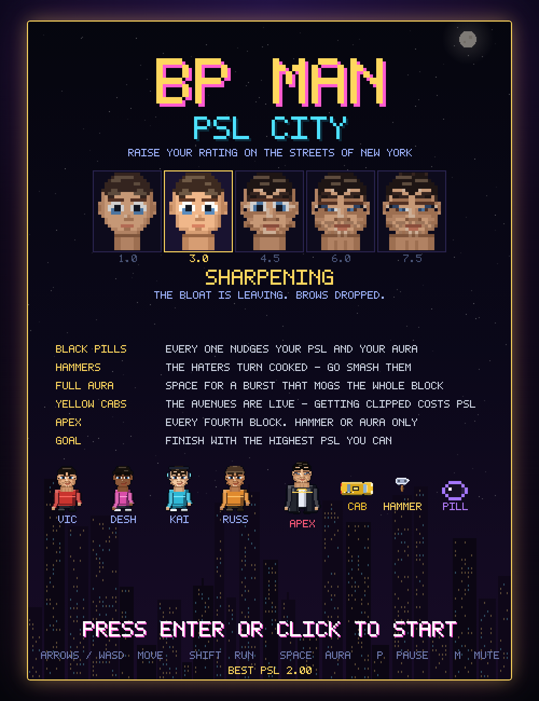
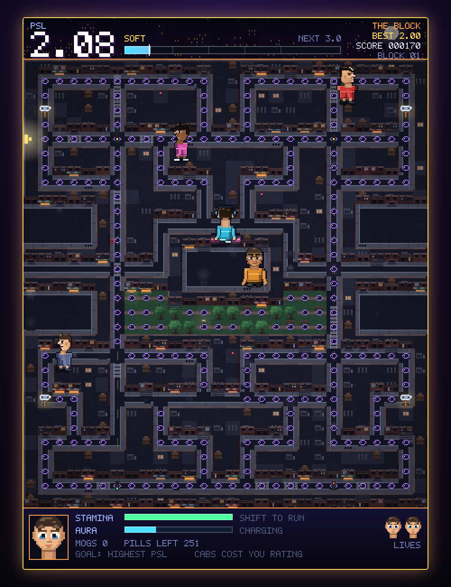
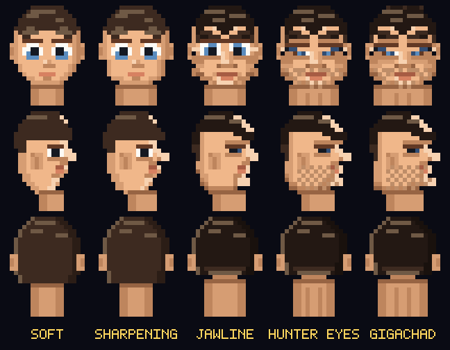
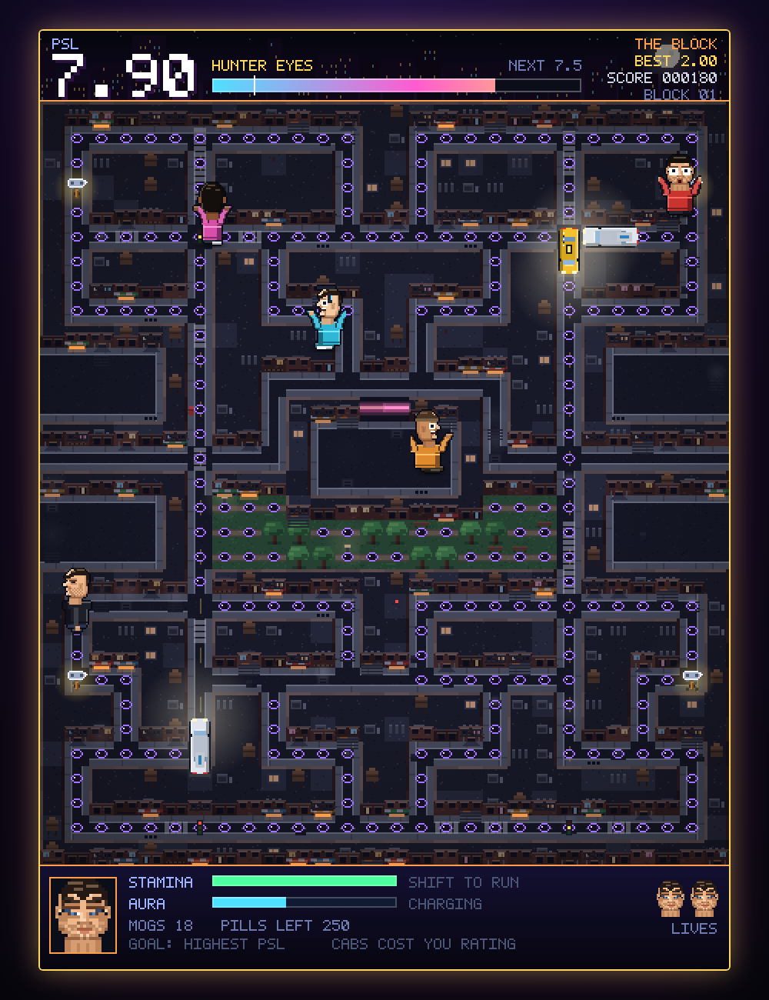
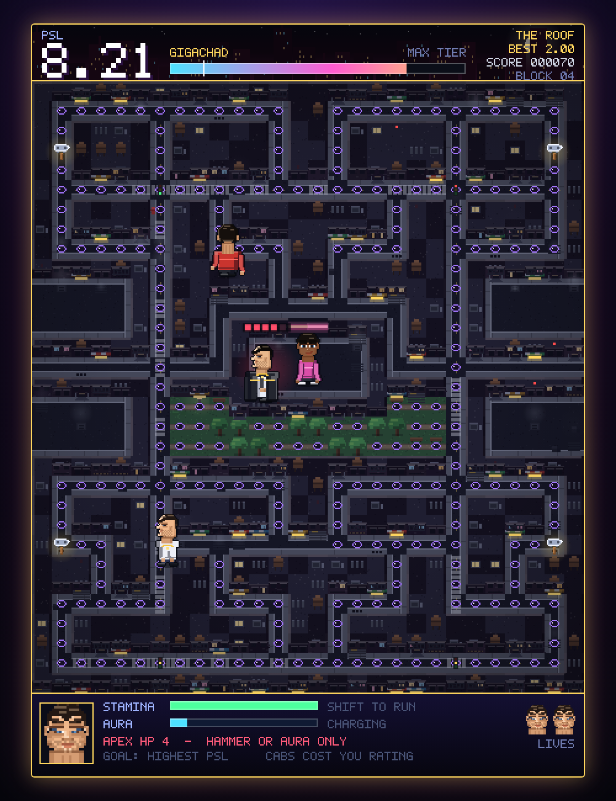
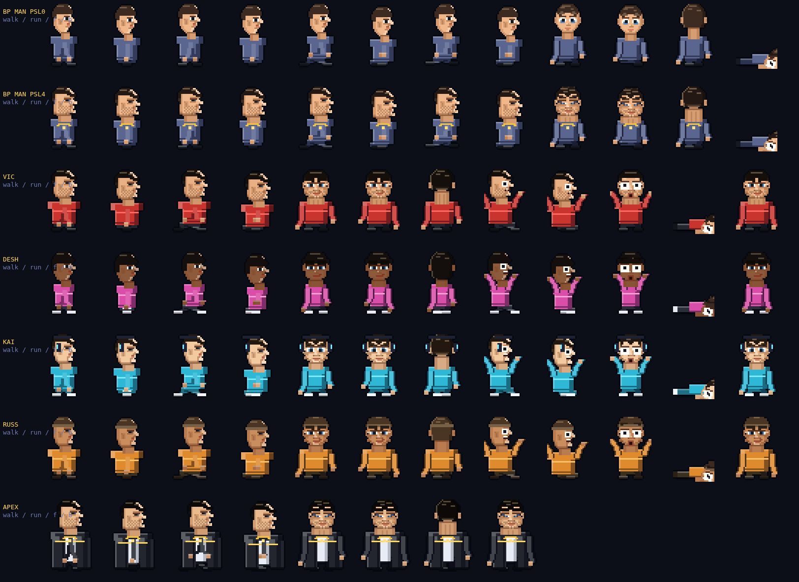

# BP MAN — PSL CITY

A high-resolution pixel-art maze chase through New York. You are on foot; so is
everyone hunting you. Eat black pills, swing hammers, mog the haters, dodge the
cabs and run the park.

Everything you do moves one number: your **PSL rating**, 1.00 to 10.00. Finishing
with the highest PSL you can is the whole point.



## Play it

Open `index.html` in a browser. No build step, no dependencies, no server.
`dist/bpman.html` is the same game as a single file you can email to someone.

## Controls

| Input | Action |
| --- | --- |
| Arrows / WASD | Walk |
| Shift | **Run** — faster, burns stamina |
| Space | **Aura burst** (when the meter is full) |
| P / M / Enter | Pause / mute / start |
| Swipe, hold, tap | Touch: swipe to turn, hold to run, tap for aura |

## What moves your PSL

| | |
| --- | --- |
| Black pill | +0.005 and a sliver of aura |
| Hammer | +0.05, and every hater on the block turns *cooked* |
| Mogging a hater | +0.15, plus 200 / 400 / 800 / 1600 in a chain |
| Bonus pickup | +0.12 to +0.60 — gym pass, shades, chin chisel, gold hammer, crown |
| Clearing a block | +0.30 |
| Downing APEX | **+1.20** |
| Getting clipped by a cab | **−0.35** and a knockdown — but never a life |
| Caught by a hater | **−0.70** and a life |

Gains taper as you climb — at PSL 8 you earn a quarter of what you did at PSL 2 —
so the last stretch of the rating is the hard part.



## The ladder

Your face is your score. Cross a gate and the game stops for an ascension
cutscene showing the old face beside the new one, front and profile.

| PSL | Tier | What changes |
| --- | --- | --- |
| 1.0 | SOFT | Round skull, doe eyes, soft mop |
| 3.0 | SHARPENING | Taper begins, brows drop |
| 4.5 | JAWLINE | Mandible flares, cheeks hollow, chin lights up |
| 6.0 | HUNTER EYES | Hooded slits with positive canthal tilt, stubble |
| 7.5 | GIGACHAD | Everything, plus the chain and the white tank |



## The city

Four districts cycle: **THE BLOCK** (brownstone row), **THE PARK**, **MIDTOWN**
(glass and steel) and **THE ROOF**, where APEX is waiting.

Buildings are drawn as rooftops seen from above — tar, water towers, AC plants,
skylights — and any building with a street below it gets a facade: brick,
lintels, fire escapes, roll-down shutters, striped awnings and lit shopfronts.
Streets get concrete sidewalks against the buildings, painted curbs that trace
the maze, asphalt down the middle, manholes that steam and zebra stripes at the
crossings.

**Four avenues are live with traffic** — Fifth, Canal, Broadway and Park. Cabs,
sedans, box trucks and the crosstown bus run them. Every car is telegraphed:
headlights flare at the mouth of the avenue and the horn sounds before it enters.
Cabs flatten haters too.



## The haters

They are people, not ghosts — same sprite system as you, with their own faces,
builds and clothes. They walk when they are scattering, run when they are hunting
you, and throw their hands up and bolt when you have a hammer.

| Name | Behaviour |
| --- | --- |
| **VIC** (red bomber, buzzcut) | Locks on and comes straight at you |
| **DESH** (magenta hoodie, long fringe) | Aims four tiles ahead of where you are going |
| **KAI** (cyan track top, headphones) | Flanks, using VIC's position to pincer you |
| **RUSS** (orange puffer, beanie) | Charges from range, backs off along your trail up close |

## APEX

Every fourth block. He is bigger, faster than your walk, and he does not scatter —
he just comes. Bare-handed contact costs a life and he takes no damage. **Hammer
contact does 1, an aura burst does 2**, and he has 5 HP, so you need several
hammer cycles to put him down. Beating him is the single biggest PSL jump in the
game.



## How it's built

Vanilla JS and one 2D canvas. Everything is drawn at 1 art-pixel to 1
canvas-pixel into an offscreen 448×610 buffer, then blitted to the visible canvas
at an integer scale with smoothing off — genuinely crisp, not a blurry upscale.

| File | What's in it |
| --- | --- |
| `js/font.js` | 5×7 bitmap arcade font |
| `js/maze.js` | The 28×31 block plan, the park, and which runs are avenues |
| `js/face.js` | The parametric face — skull half-widths, eyes, brows, hair, stubble — with palette and expression overrides |
| `js/human.js` | Bodies: hip-knee-foot skeleton, walk / run / panic / down, outlined so people read against the street |
| `js/sprites.js` | Pills, hammers, bonus pickups, contact shadows |
| `js/city.js` | Bakes the plan into New York: rooftops, facades, sidewalks, the park, steam and neon |
| `js/traffic.js` | Cabs, sedans, trucks and the bus, drawn top-down with headlight wash |
| `js/audio.js` | WebAudio synthesis — no sound files |
| `js/game.js` | PSL, stamina, hater AI, the boss, the HUD and the screens |

Two pieces are worth a look. **`face.js`** is one renderer that interpolates a
table of skull half-widths from SOFT to GIGACHAD and swaps discrete features
(doe eyes → neutral → hooded slits, mop → faded cut, stubble on or off). The same
20×24 routine draws the sprite in the street, the HUD portrait at 2× and the
ascension cutscene at 4×. **`human.js`** builds everyone — you, the four haters
and APEX — from that face plus a parameterised body, so a new character is a
dozen lines of palette and outfit.



## Development

```sh
node build.js                # bundle to dist/
node tools/validate-maze.js  # every pill reachable, rows well formed
node tools/playtest.js       # 29 headless gameplay assertions
node tools/shot.js           # gameplay screenshots
node tools/sheet.js          # cast sprite sheet
```

The tooling needs Playwright (`npm i playwright`) and a Chromium binary; the game
itself needs nothing.
